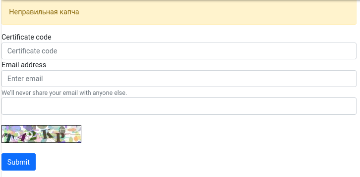

### Экранные формы

Три экранных формы по проверке сертификаты в ИБ.

Первая проверка сертификата, 
Вторая форма - поле воода кода подтверждения, 
Третья форма Детальная страница активированного\заблокированного сертификата. Причина не активации сертификата. 

Комлексный компонент, без перезагрузки страницы чпу или get параметров.
Компонент проверяет сертификат, активирует его и посылает емейл ооб успешной активации\деактивации

### Скриншоты
